Mario: Sum Decoration/Space Coverage/Leniency with 10 Segments
--------------------------------------------------------------
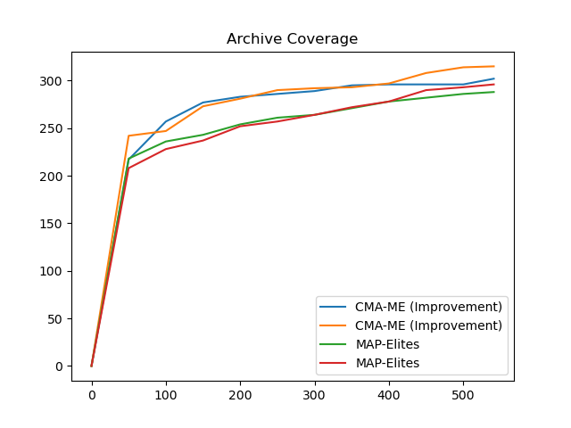
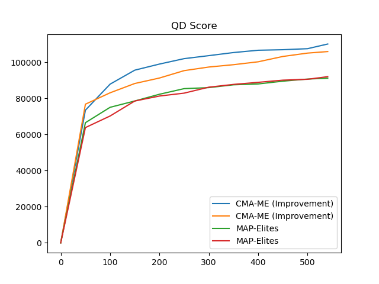
Mario: Distinct Segments/Alternating Space Coverage/Alternating Decoration with 10 Segments
-------------------------------------------------------------------------------------------
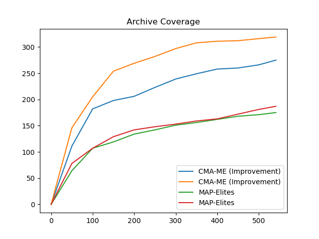
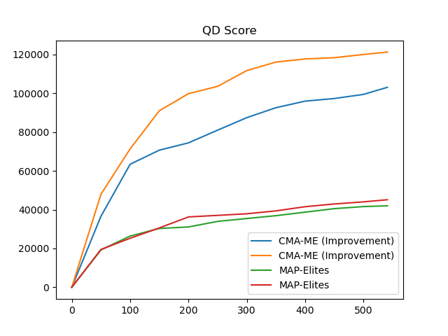
Mario: Latent Partition into 2 Slices with 2 Segments
-----------------------------------------------------
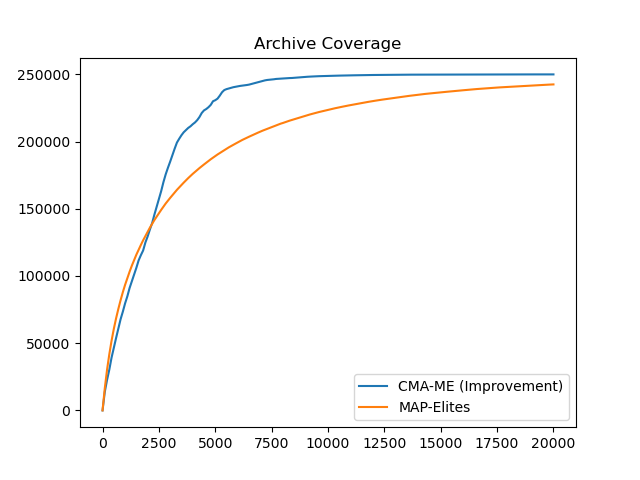
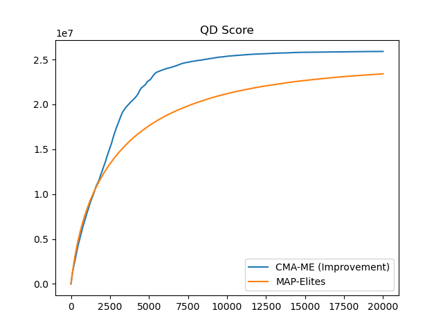
Lode Runner: Ground Percentage/Gold Count/Enemy Count
-----------------------------------------------------
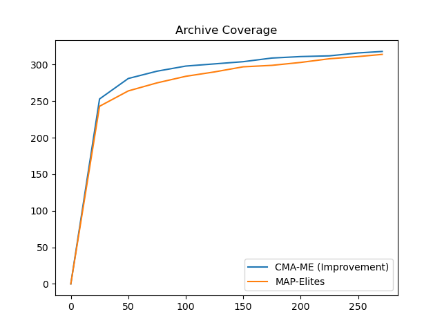
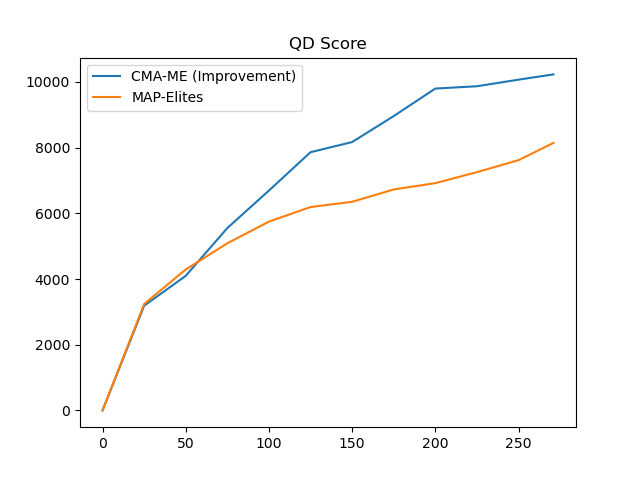
Mega Man: Distinct Segments/Vertical Segments/Connectivity Percentage with 10 Segments
--------------------------------------------------------------------------------------
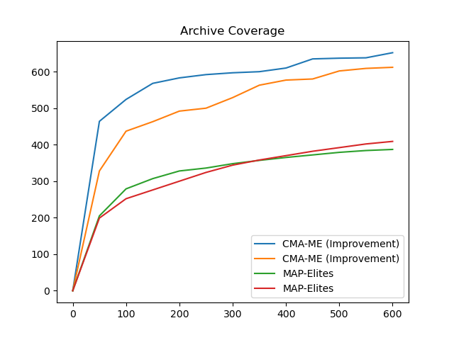
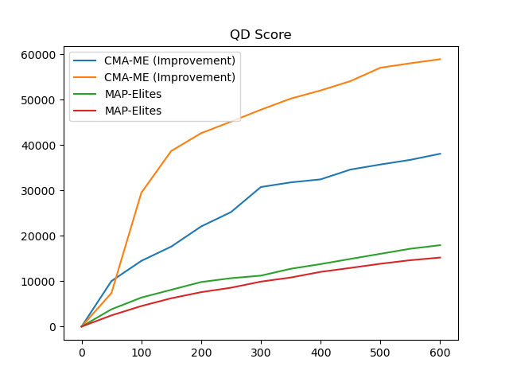
Zelda: Wall Percentage/Water Percentage/Reachable Room Count with 5 by 5 Dungeons
---------------------------------------------------------------------------------
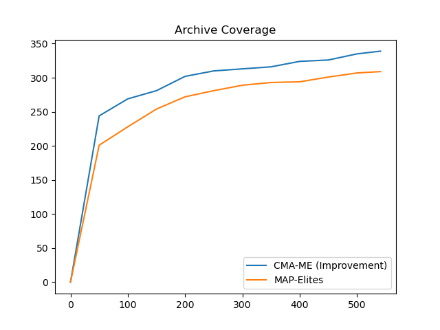
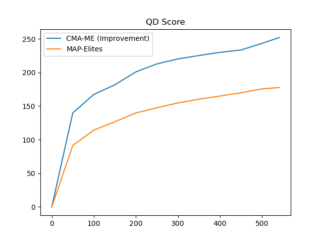
Zelda: Distinct Rooms/Backtracked Rooms/Reachable Rooms with 5 by 5 Dungeons
----------------------------------------------------------------------------
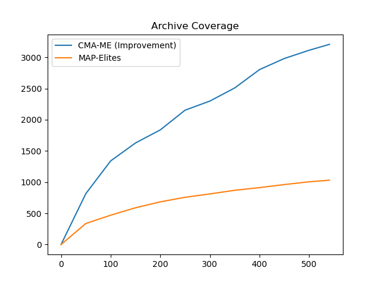
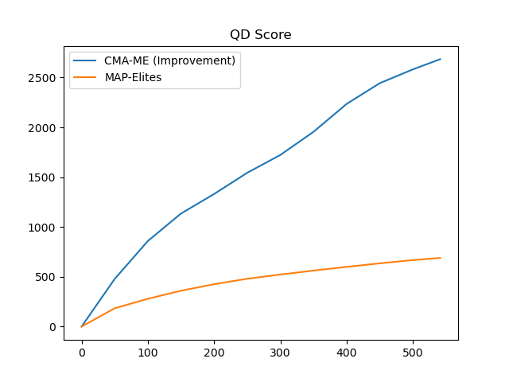